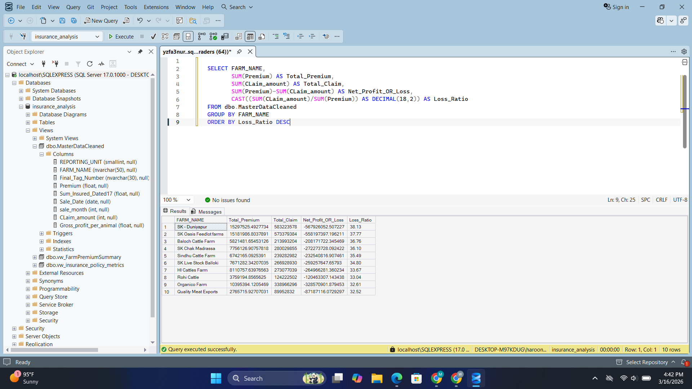
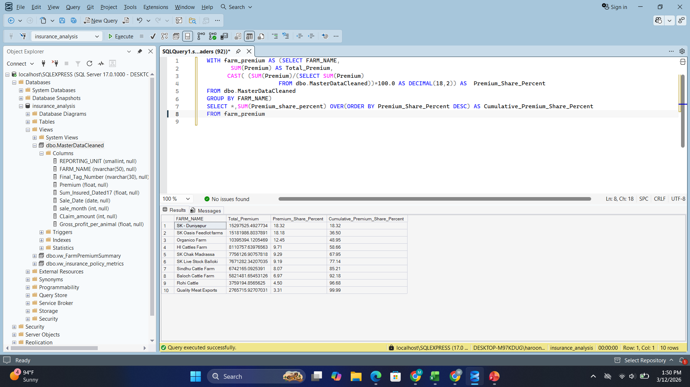
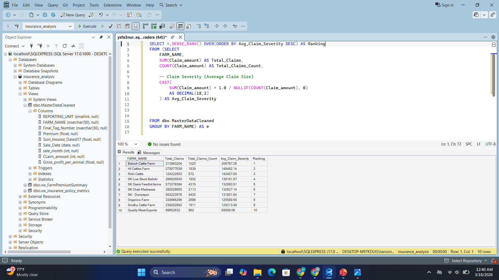
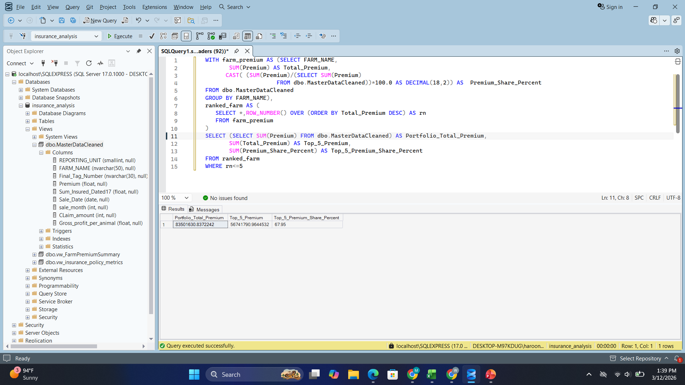

# Insurance Portfolio Risk & Profitability Analysis

Real-world SQL portfolio analysis on **22,000+ insurance records** to evaluate loss ratios, revenue concentration, and farm-level profitability.

End-to-end SQL and spreadsheet pipeline for cleaning, transforming, and analyzing operational insurance data to generate portfolio risk insights.


## Executive Summary
Analyzed a dataset of **22,090 insurance records** with 104 attributes to evaluate portfolio health.  
The analysis transformed raw operational insurance data into a structured analytical dataset to identify **revenue concentration, portfolio risk exposure, and operational inefficiencies**.

Key objective was to provide actionable insights to help management understand profitability drivers and potential risk areas within the insurance portfolio.


## Key Metrics Snapshot

| Metric                     | Value        |
|--------------------------|-------------|
| Total Records            | 22,090      |
| Total Farms              | 10          |
| Total Sum Insured        | 278M+       |
| Total Premium            | 8.35M       |
| Total Claims             | 298M+       |
| Portfolio Loss Ratio     | 35.72       |


## Project Highlights

• Analyzed **22,000+ livestock insurance records** across **10 farms**  
• Built an **end-to-end SQL data pipeline** for cleaning, transformation, and risk analysis  
• Identified **severe portfolio underpricing** with a loss ratio of **35.72**  
• Revealed **revenue concentration risk**, with **67.95% of premium generated by the top 5 farms**  
• Detected **critical exposure farms** responsible for the largest financial losses
• Developed multi-factor risk scoring model combining severity, frequency, and exposure
 


## Technology Stack
- **SQL** – Data transformation, aggregation, and portfolio risk modeling
- **Spreadsheets (Excel / Google Sheets)** – Preliminary data exploration and early ETL
- **Documentation** – Project report summarizing analysis and insights


  ## SQL Skills Demonstrated

This project demonstrates practical application of SQL in a real-world analytical context:

- Data Cleaning & Transformation  
  - Handling missing values  
  - Standardizing inconsistent fields  
  - Removing redundant columns  

- Aggregations & Window Functions  
  - `SUM()`, `COUNT()`, `GROUP BY`  
  - `DENSE_RANK()` for ranking farms  
  - Window functions for cumulative analysis  

- Business Metrics Calculation  
  - Loss Ratio  
  - Premium Share  
  - Claim Frequency & Severity  

- Analytical Modeling  
  - Risk classification using CASE logic  
  - Multi-factor risk scoring model  
  - Portfolio concentration analysis  

- Performance Analysis  
  - Farm-level profitability  
  - Revenue contribution  
  - Risk segmentation  

This reflects SQL usage beyond querying, focusing on **decision-support analytics and risk modeling**.


## Project Workflow

The project follows a structured data analytics pipeline:

Raw Operational Data  
→ Data Cleaning & Standardization  
→ Exploratory Portfolio Analysis  
→ Risk Modeling & Performance Metrics  
→ Business Insights & Documentation

This workflow mirrors a typical **analytics pipeline used in production environments**, where raw operational data is transformed into decision-support insights.


## Business Problem
The insurance company maintained a large dataset across multiple branches with limited analytical visibility into portfolio performance:

1. Which farms generate the highest premium revenue
2. Which farms or branches carry the highest claims risk
3. Data integrity issues such as inconsistent tag numbers and missing insured values

The goal was to clean the dataset and produce insights that support better portfolio management decisions.


## Key Analytical Questions

The analysis focuses on key portfolio-level questions relevant to insurance risk management:

1. **Portfolio Health**
   - Is the overall portfolio profitable based on premium vs claims?

2. **Revenue Drivers**
   - Which farms generate the highest premium revenue?

3. **Loss Drivers**
   - Which farms contribute the largest financial losses?

4. **Portfolio Concentration Risk**
   - Is premium revenue concentrated among a few farms?

5. **High-Value High-Risk Exposure**
   - Which farms combine high premium contribution with high loss ratios?

These analytical questions guided the SQL queries and risk modeling performed in the project.


## Data Engineering Pipeline

### Data Cleaning
- Standardized `Tag Number` formats
- Handled missing values in **Sum Insured**
- Removed **40+ redundant columns**
- Prepared structured, analysis-ready dataset

### Risk Modeling
Key SQL calculations implemented:

- **Premium Calculation**
  Applied a standard **3% premium rate** on `Sum Insured`

- **Claims-to-Premium Ratio**
  Identified farms where `Claim Amount > Premium`

- **Year-over-Year Analysis**
  Compared performance across **2024 and 2025**


## Key Insights

### Portfolio Overview
- The portfolio contains **22,088 insured animals** across **10 farms**.
- Total insured exposure exceeds **278M**, highlighting substantial financial liability.
- Total premium income is approximately **8.35M**, while total claims exceed **298M**.
- The portfolio-level loss ratio is **35.72**, meaning claims are approximately **35 times higher than collected premium**, indicating severe portfolio underpricing.
  
### Farm-Level Risk & Profitability
- Financial performance varies significantly across farms, with some generating strong premium income while others contribute disproportionately to claims.
- **Hi Cattle Farm** is one of the highest premium-generating farms in the portfolio.
- **SK Oasis Feedlot Farms** shows one of the highest farm-level loss ratios, indicating elevated risk exposure.
- **Organic Farm** demonstrates comparatively stronger profitability and lower loss pressure than several other farms.

### Revenue Concentration
- Premium revenue is highly concentrated across a small number of farms.
- The **top 3 farms contribute 48.95%** of total premium income.
- The **top 5 farms contribute 67.95%** of total premium income.
- The **top 7 farms contribute 85.21%** of total premium income.
- This indicates strong dependency risk, where the portfolio relies heavily on a limited number of farms for revenue generation.


## Risk Modeling Insights

Advanced SQL analysis was performed to identify key risk drivers and portfolio exposure patterns.

### Largest Loss Contributors
- **SK-Duniyapur** is the largest loss contributor
- **SK Oasis Feedlot Farms** ranks second

These farms represent a significant share of total portfolio losses, indicating concentrated risk exposure.


### Portfolio Risk Distribution
- All farms fall into the **High Risk category**
- Claims exceed premium across the entire portfolio

This suggests fundamental issues in:
- pricing strategy  
- underwriting standards  
- risk selection  


### High-Value High-Risk Farms
Two farms were identified as **Critical Exposure**:

- **SK-Duniyapur**
- **SK Oasis Feedlot Farms**

These farms combine:
- high premium contribution (~18%)
- extremely high loss ratios (>37)

They represent the most significant risk points in the portfolio.


### Composite Risk Scoring Model

A multi-factor risk model was developed using:

- **Loss Ratio (50%)**
- **Premium Share (30%)**
- **Claim Frequency Share (20%)**

#### Key Findings
- **SK-Duniyapur** ranks highest due to extreme loss ratio, high frequency, and large premium share  
- **SK Oasis Feedlot Farms** ranks second, confirming critical exposure  
- High frequency combined with high loss ratios significantly increases portfolio risk  
- Lower-risk farms show smaller premium share and reduced claim frequency  

This analysis highlights that portfolio risk is driven by both:

- **how often claims occur (frequency)**  
- **how large each claim is (severity)**  

Understanding this distinction is critical for effective pricing and underwriting decisions.


  
## Portfolio Metrics

Key metrics generated from the SQL analysis:

- **Total Insured Animals:** 22,088  
- **Total Farms:** 10  
- **Total Sum Insured:** 278M+  
- **Total Premium Collected:** 8.35M  
- **Total Claims Paid:** 298M+  
- **Portfolio Loss Ratio:** 35.72  

### Revenue Concentration Metrics

- Top **3 farms:** 48.95% of premium
- Top **5 farms:** 67.95% of premium
- Top **7 farms:** 85.21% of premium

These metrics highlight **portfolio dependency risk**, where a large portion of revenue is generated by a limited number of farms.


## Portfolio Risk Interpretation

The analysis reveals several structural issues within the insurance portfolio.

### Severe Underpricing Risk
A loss ratio of **35.72** indicates claims are approximately **35 times higher than premium**, making the portfolio financially unsustainable.

In a stable insurance model, loss ratios typically range between **0.60 and 0.80**.


### Exposure Concentration Risk
Revenue is heavily concentrated among a few farms:

- Top 3 farms → **48.95%**
- Top 5 farms → **67.95%**
- Top 7 farms → **85.21%**

This creates dependency risk and reduces portfolio stability.


### Critical Risk Farms
- **SK-Duniyapur**
- **SK Oasis Feedlot Farms**

These farms combine high revenue contribution with extreme loss ratios, making them the primary risk drivers.

Without intervention, they pose a significant threat to portfolio sustainability.


## Business Recommendations

Based on the portfolio analysis, the following actions are recommended:

### 1. Review Pricing Strategy
The extremely high loss ratio (35.72) indicates severe underpricing. Premium rates should be reassessed to better reflect actual risk exposure.

### 2. Re-evaluate High-Risk Farms
Farms such as **SK-Duniyapur** and **SK Oasis Feedlot Farms** should undergo detailed underwriting review, including:
- risk profiling
- coverage adjustments
- potential premium increases

### 3. Implement Risk Segmentation
The portfolio should be segmented based on:
- loss ratio
- claim frequency
- claim severity

This will allow differentiated pricing and risk management strategies.

### 4. Introduce Claim Monitoring Controls
High claim frequency farms should be monitored closely to identify:
- operational inefficiencies
- potential fraud or over-reporting
- recurring loss patterns

### 5. Reduce Revenue Concentration Risk
Diversify the portfolio by:
- acquiring new farms
- reducing dependency on top contributors

This will improve portfolio stability and reduce exposure concentration.


## Analytical Considerations

While the analysis is based on real operational insurance data, the following considerations should be noted:

- Premium values were calculated using a standardized **3% rate**, which may differ from actual pricing and underwriting policies across insurance portfolios  
- Claim data is aggregated at the farm level and does not distinguish between different types of losses  
- External risk factors such as environmental conditions, disease outbreaks, and regional variations are not included  
- The analysis assumes consistent policy structure across farms, whereas real-world portfolios may have varying coverage terms and risk profiles  

These considerations should be taken into account when interpreting results and can be refined in future analysis.


## Business Value

This analysis provides several operational and financial insights:

- Identifies **revenue concentration risk**, where a large share of premium income depends on a small number of farms.
- Highlights **high-loss farms** that require underwriting review or pricing adjustments.
- Reveals systemic portfolio risk where claims consistently exceed premiums.
- Improves **data quality visibility** by identifying missing values and inconsistent identifiers.
- Provides a **structured portfolio risk view** to support insurance pricing, underwriting, and risk management decisions.

These insights help insurance managers better understand portfolio exposure and improve strategic decision-making.


## Project Structure

```
insurance-claims-risk-analysis
│
├── data
│   ├── insurance_raw_sample_100_rows.csv
│   └── insurance_clean_sample_100_rows.csv
│
├── scripts
│   ├── 01_Cleaning_Pipeline.sql
│   ├── 02_Exploratory_Portfolio_Analysis.sql
│   └── 03_Risk_Modeling.sql
│
├── docs
│   └── insurance-claims-risk-analysis-report.pdf
│
├── README.md
└── LICENSE
```
### Scripts Overview

- **01_Cleaning_Pipeline.sql** – Data cleaning, tag standardization, missing value handling, premium calculation.
- **02_Exploratory_Portfolio_Analysis.sql** – Initial data exploration and summary metrics.
- **03_Risk_Modeling.sql** – Farm-level risk classification, loss contribution analysis, and critical portfolio exposure modeling.


## Exploratory Portfolio Analysis

The exploratory analysis stage was implemented in **`02_Exploratory_Portfolio_Analysis.sql`** to understand portfolio structure, revenue distribution, and farm-level performance.

The analysis was structured around five core SQL investigations:

1. **Portfolio Summary**
   - Measured total animals, farms, total insured value, premium income, total claims, and portfolio-level loss ratio.

2. **Farm-Level Performance Analysis**
   - Compared premium, claims, loss ratio, and net profitability across farms.

3. **Premium Share by Farm**
   - Calculated each farm’s contribution to total premium revenue.

4. **Top 5 Revenue Contribution**
   - Measured how much of the portfolio’s premium income comes from the top five farms.

5. **Cumulative Premium Concentration**
   - Evaluated how revenue accumulates across farms to identify dependency concentration and concentration risk.


## Project Documentation

📄 **Portfolio Analysis Report**

A supporting project report developed during the early exploratory stage of the analysis using spreadsheet-based ETL and preliminary portfolio evaluation.

The report documents:
- Initial dataset exploration
- Early portfolio observations
- Preliminary business insights prior to the SQL-based analytical pipeline

The final insights and validated metrics presented in this repository were produced through the **SQL data pipeline and analytical queries included in the `scripts` directory**.

[View Portfolio Analysis Report](docs/insurance-claims-risk-analysis-report.pdf)


## Example SQL Query

Example SQL used to generate portfolio summary metrics:

```sql
SELECT 
COUNT(*) AS Total_animals,
COUNT(DISTINCT FARM_NAME) AS Total_farms,
SUM(Sum_Insured_Dated17) AS Total_Sum_Insured,
SUM(Premium) AS Total_Premium,
SUM(Claim_amount) AS Total_Claim,
CAST(SUM(Claim_amount) / NULLIF(SUM(Premium),0) AS DECIMAL(18,2)) AS Loss_Ratio
FROM dbo.MasterDataCleaned;

Additional analytical and risk modeling queries are available in:

`scripts/02_Exploratory_Portfolio_Analysis.sql`  
`scripts/03_Risk_Modeling.sql`
```


## Sample Analytical Output

These results represent key stages of the analytical workflow and support the insights presented in this project.

---

### Portfolio Summary

This output provides a high-level overview of the insurance portfolio, including total premium, total claims, and overall loss ratio.



*Figure: Portfolio-level performance summary generated using SQL*

👉 Insight: The portfolio shows extreme imbalance between premium and claims, confirming severe underpricing and unsustainable risk exposure.

---

### Premium Concentration Analysis

This analysis highlights how premium revenue is distributed across farms and identifies dependency on top contributors.



*Figure: Premium revenue concentration across farms*

👉 Insight: A small number of farms dominate premium contribution, exposing the portfolio to significant concentration and dependency risk.

---

### Composite Risk Scoring Model

This output shows the multi-factor risk scoring model, ranking farms based on loss ratio, premium share, and claim frequency.



*Figure: Multi-factor risk scoring model combining severity, exposure, and frequency*

👉 Insight: SK-Duniyapur and SK Oasis Feedlot Farms rank as the highest-risk entities due to a combination of high loss ratios, high claim frequency, and significant premium share.

---

### Top Farms Revenue Contribution

This output highlights the farms contributing the highest share of premium revenue, helping identify key revenue drivers in the portfolio.



*Figure: Top revenue-generating farms based on premium contribution*

👉 Insight: The portfolio is heavily reliant on a few farms for revenue, increasing financial vulnerability if these farms underperform.

---


## How to Run the Project

## How to Run the Project

1. Import the raw dataset into SQL Server.

2. Run the cleaning pipeline:  
   [01_Cleaning_Pipeline.sql](scripts/01_Cleaning_Pipeline.sql)

3. Run exploratory analysis:  
   [02_Exploratory_Portfolio_Analysis.sql](scripts/02_Exploratory_Portfolio_Analysis.sql)

4. Run risk modeling queries:  
   [03_Risk_Modeling.sql](scripts/03_Risk_Modeling.sql)


## Dataset

A sample of the raw dataset (100 rows) used in the analysis is available below.

📊 **Download Sample Dataset**

[insurance_raw_sample_100_rows.csv](data/insurance_raw_sample_100_rows.csv)


## Author
**Syed Shahwaiz Ali**

Data Analyst | SQL | Data Analytics | Risk Analysis | Portfolio Analytics | Data Cleaning
